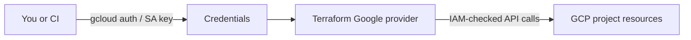

# GCP Authentication & Authorization Guide

A plain-language, step-by-step guide to giving Terraform what it needs to create resources in your Google Cloud project. If you're new to GCP, follow this once and you're set.

## Two concepts in one minute

- **Authentication** = "Who are you?" (logging in).
- **Authorization (IAM)** = "What are you allowed to do?" (roles).

Terraform needs both: it must be able to log in *and* have permission to create networks, firewalls, and VMs in your project.



## Prerequisites

1. A Google account.
2. A GCP project. Create one in the Cloud Console or:

   ```bash
   gcloud projects create my-proj --name="My Project"
   ```

3. A billing account linked to the project (required even for free-tier VMs). Do this in the Cloud Console under **Billing**.
4. The gcloud CLI installed: <https://cloud.google.com/sdk/docs/install>.
5. Set the active project:

   ```bash
   gcloud config set project my-proj
   ```

## Enable the APIs Terraform calls

Terraform needs the Compute Engine API. Enable it once:

```bash
gcloud services enable compute.googleapis.com
```

If you ever see "API ... has not been used in project ... before" during `terraform apply`, run the same `gcloud services enable` command for the API in the error.

## Choose an authentication method

| Option | Best for | Long-lived secret? |
|---|---|---|
| A. Personal login (ADC) | Learning, local development | No |
| B. Service Account JSON key | CI / automation | Yes (handle carefully) |
| C. Workload Identity Federation | Production CI (e.g. GitHub Actions) | No |

Most readers should start with Option A.

## Option A – personal login (simplest)

1. Log into gcloud:

   ```bash
   gcloud auth login
   ```

2. Create Application Default Credentials (ADC). The Terraform Google provider auto-discovers these:

   ```bash
   gcloud auth application-default login
   ```

3. Verify:

   ```bash
   gcloud auth list
   gcloud auth application-default print-access-token
   ```

That's it. You can now run `terraform init && terraform apply`.

## Option B – service account with a JSON key

Use this for CI servers or shared automation. Replace `my-proj` with your project ID.

```bash
PROJECT=my-proj
SA_NAME=terraform-deployer

gcloud iam service-accounts create $SA_NAME \
  --display-name="Terraform deployer" \
  --project=$PROJECT

SA_EMAIL=$SA_NAME@$PROJECT.iam.gserviceaccount.com

# Grant only the roles Terraform needs (least privilege)
for ROLE in \
  roles/compute.admin \
  roles/compute.networkAdmin \
  roles/iam.serviceAccountUser; do
  gcloud projects add-iam-policy-binding $PROJECT \
    --member="serviceAccount:$SA_EMAIL" \
    --role="$ROLE"
done

# Create a JSON key file
gcloud iam service-accounts keys create ./tf-sa-key.json \
  --iam-account=$SA_EMAIL

# Tell Terraform where to find it
export GOOGLE_APPLICATION_CREDENTIALS="$PWD/tf-sa-key.json"
```

Important:

- `tf-sa-key.json` is a long-lived secret. **Never commit it.** The included `.gitignore` already excludes `*.json`.
- When you're done with the key, delete it:

  ```bash
  gcloud iam service-accounts keys list --iam-account=$SA_EMAIL
  gcloud iam service-accounts keys delete <KEY_ID> --iam-account=$SA_EMAIL
  ```

- To rotate, create a new key, switch `GOOGLE_APPLICATION_CREDENTIALS`, then delete the old one.

## Option C – Workload Identity Federation (CI without long-lived keys)

For production CI like GitHub Actions or GitLab CI, prefer federation: your CI's identity token is exchanged for short-lived GCP credentials, so no JSON key ever exists. Setup is a few extra steps; see the official guide:

- <https://cloud.google.com/iam/docs/workload-identity-federation>

## IAM role cheat-sheet

The minimum roles Terraform needs to run this project:

| Role | Why |
|---|---|
| `roles/compute.admin` | Create / delete VMs and disks |
| `roles/compute.networkAdmin` | Create / delete VPCs, subnets, firewalls |
| `roles/iam.serviceAccountUser` | Attach service accounts to VMs (needed even if you don't, for some operations) |

For quick experimentation only, `roles/editor` works but is too broad for production.

To grant a role to your user (instead of a service account):

```bash
USER=you@example.com
gcloud projects add-iam-policy-binding my-proj \
  --member="user:$USER" \
  --role="roles/compute.admin"
```

## Verify everything works

```bash
gcloud auth list
gcloud config get-value project
gcloud compute networks list   # should not error
```

If those work, Terraform will too.

## Common errors and fixes

| Error message | What it means | Fix |
|---|---|---|
| `Application Default Credentials were not found` | No login on this machine | `gcloud auth application-default login` or set `GOOGLE_APPLICATION_CREDENTIALS` |
| `Permission ... denied` / `403` | Missing IAM role | Add the missing role from the cheat-sheet above |
| `API ... has not been used in project ...` | API not enabled | `gcloud services enable <api-name>` |
| `Billing has not been enabled` | Project has no billing account | Link a billing account in the Cloud Console |
| `Quota exceeded` | Project quota too low | Request quota or reduce `vm_count` / `machine_type` |
| `Project not found` | Wrong/missing project ID | `gcloud config set project <id>` and check `terraform.tfvars` |

## Security best practices

- Prefer **Option A** (ADC) for personal use, **Option C** (federation) for CI. Use Option B only when you truly need a static credential.
- Always grant **least privilege** – only the roles in the cheat-sheet, not `roles/owner`.
- **Never commit** `tf-sa-key.json`, `terraform.tfvars`, `*.pem`, or `*.tfstate`. The included `.gitignore` covers all of these.
- **Rotate** service-account keys regularly and delete unused ones.
- For production, store Terraform state in a **remote backend** (e.g. a GCS bucket with versioning and uniform bucket-level access) instead of local files.
- Restrict `ssh_source_ranges` in `terraform.tfvars` to your own IP rather than `0.0.0.0/0`.

## What's next

Once `gcloud compute networks list` runs without errors, you're ready to deploy. Continue with [USER_GUIDE.md](USER_GUIDE.md) or just:

```bash
cd deploy-vm-google
cp terraform.tfvars.example terraform.tfvars
# edit project_id and any other knobs
terraform init
terraform apply
```
