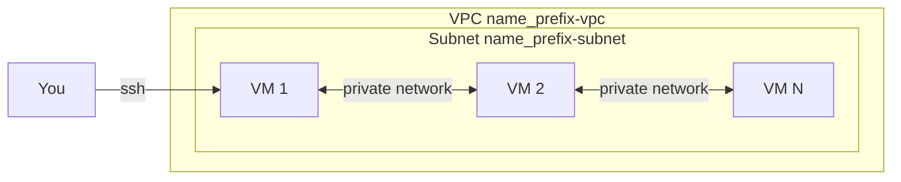

# User Guide

A plain-language walkthrough of the `deploy-vm-google` Terraform project. If you've never used Terraform or Google Cloud before, start here.

For getting GCP authentication and permissions ready, see [AUTH_GUIDE.md](AUTH_GUIDE.md).

## What this project does

Creates one private network (a VPC) on Google Cloud and launches any number of virtual machines inside it. All VMs share the same subnet so they can talk to each other on a private network. You can SSH into them from your laptop using a keypair Terraform creates for you.



## Prerequisites

- A Google account with a GCP project and billing enabled.
- The gcloud CLI installed: <https://cloud.google.com/sdk/docs/install>.
- Terraform 1.3 or newer: <https://developer.hashicorp.com/terraform/install>.
- An SSH client (built into macOS/Linux; on Windows use WSL or OpenSSH).

## One-time setup

1. Authenticate to GCP (full details in [AUTH_GUIDE.md](AUTH_GUIDE.md)):

   ```bash
   gcloud auth application-default login
   gcloud config set project <your-project-id>
   ```

2. Enable the Compute Engine API:

   ```bash
   gcloud services enable compute.googleapis.com
   ```

## File-by-file tour

### `main.tf`

The "what to build" file. It defines:

- The Google provider (which cloud, which project, which region/zone).
- An optional SSH keypair (`tls_private_key` + `local_sensitive_file`) generated only when you don't supply your own key.
- A VPC (`google_compute_network`) – your isolated network.
- A subnet (`google_compute_subnetwork`) – an IP range inside the VPC where the VMs live.
- Two firewall rules:
  - `allow-internal`: VMs in the subnet can talk to each other freely.
  - `allow-ssh`: port 22 is open from `ssh_source_ranges`, but only to VMs that carry the `<name_prefix>-ssh` tag (set automatically).
- The VMs themselves (`google_compute_instance` with `count = var.vm_count`). Each VM:
  - Boots from `var.image` with a `var.disk_size_gb` disk.
  - Joins the same VPC/subnet.
  - Optionally gets a public IP (`assign_public_ip`).
  - Receives the SSH public key in metadata.
  - Has Shielded VM features enabled for extra security.

### `variables.tf`

The "knobs you can turn" file. Every input has a description, a sensible default (where possible), and validation. Highlights:

| Variable | What it means | When to change it |
|---|---|---|
| `project_id` | Your GCP project ID | Always set this |
| `region` / `zone` | Where to deploy | Pick one near you |
| `name_prefix` | Prefix for every resource name | Change to label your environment |
| `vm_count` | How many VMs to create | Scale up or down |
| `machine_type` | VM size | Bigger for more CPU/RAM |
| `image` | OS image | Default Ubuntu 24.04 LTS amd64; override for another OS or arm64 (`ubuntu-2404-lts-arm64` on T2A) |
| `disk_size_gb` | Boot disk size | Larger if you need more storage |
| `subnet_cidr` | Private IP range | Avoid clashes with other networks |
| `assign_public_ip` | Public IP per VM | Set false if you only want internal access |
| `ssh_source_ranges` | Who can SSH | Restrict to your IP for safety |
| `ssh_user` | SSH username | Default `ubuntu` matches the default image; if you change `image`, use the username that image expects |
| `ssh_public_key` | Your SSH public key | Leave empty to auto-generate |
| `tags` | Extra network tags | For your own firewall scoping |
| `labels` | Resource labels | Cost tracking, environment tagging |

### `outputs.tf`

The "what you get back" file. After `terraform apply`, run `terraform output` to see:

- `vpc_name`, `subnet_name` – the network you just created.
- `vm_names`, `vm_internal_ips`, `vm_external_ips` – your VMs.
- `ssh_user`, `ssh_private_key_path` – how to log in.
- `ssh_public_key` – the key injected into the VMs (marked sensitive).
- `ssh_commands` – ready-to-run `ssh ...` commands, one per VM.

### `terraform.tfvars.example`

A copy-and-edit starting point. Real values go in `terraform.tfvars` (which is in `.gitignore`).

### `.gitignore`

Keeps secrets and state out of git: `.terraform/`, `*.tfstate`, `*.pem`, `*.json` (e.g. service-account keys), and `terraform.tfvars`.

## Step-by-step deploy

```bash
cd deploy-vm-google
cp terraform.tfvars.example terraform.tfvars
# edit terraform.tfvars: set project_id, vm_count, etc.

terraform init     # downloads providers
terraform plan     # shows what will be created
terraform apply    # type 'yes' to confirm
```

When apply finishes, view the SSH commands:

```bash
terraform output ssh_commands
```

Run one of them, e.g.:

```bash
ssh -i demo-key.pem ubuntu@34.123.45.67
```

## How to scale

Edit `vm_count` in `terraform.tfvars` and re-run `terraform apply`. Terraform only creates or removes the VMs that changed; the VPC, subnet, and existing VMs stay put.

## How to clean up

```bash
terraform destroy
```

This deletes every resource Terraform created, including the generated `*-key.pem` file.

## Troubleshooting

- "Application Default Credentials were not found" – run `gcloud auth application-default login` (see [AUTH_GUIDE.md](AUTH_GUIDE.md)).
- "API not enabled" / "compute.googleapis.com" – `gcloud services enable compute.googleapis.com`.
- "Quota exceeded" – lower `vm_count` or `machine_type`, or request a quota increase in the Cloud Console.
- "Permission denied (publickey)" on SSH – make sure `ssh_user` matches your `image` (default Ubuntu cloud image uses `ubuntu`) and that `ssh_source_ranges` includes your public IP.
- Connection times out – check that `assign_public_ip = true` and the SSH firewall allows your source IP.

## Security checklist (recommended)

- Restrict `ssh_source_ranges` to your IP, not `0.0.0.0/0`.
- Don't commit `terraform.tfvars`, `*.pem`, or service-account JSON keys.
- For production, use a remote state backend (GCS bucket with versioning).
- Use `labels` to track cost and ownership.
- Rotate SSH keys periodically (`terraform destroy && terraform apply` regenerates them).

## FAQ

- **Can I use a different region?** Yes. Set `region` and `zone` in `terraform.tfvars`. The zone must be inside the region.
- **Can I bring my own SSH key?** Yes. Set `ssh_public_key` to the contents of your `~/.ssh/id_rsa.pub` (or similar).
- **Can I install software on boot?** Add a `metadata_startup_script` block to `google_compute_instance.vm` in `main.tf`.
- **Can I attach more disks?** Add an `attached_disk` block on `google_compute_instance.vm`.
- **Does this cost money?** Yes – running VMs and using public IPs are billable. Run `terraform destroy` when you're done.
