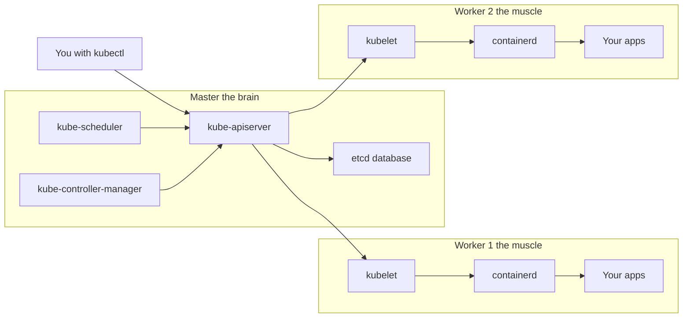

# A Beginner's Guide to the Multi-node Cluster

This guide explains, in everyday language, what these Ansible playbooks
actually do, so you understand the cluster you just built (or are about
to build). Skip around — every section stands on its own.

If you've already read [`single-node-cluster/GUIDE.md`](../single-node-cluster/GUIDE.md),
about half of this will look familiar — the per-node setup is the same.
The new bits are about *coordinating* multiple machines.

---

## 1. The big picture, in plain English

Kubernetes is "an operating system for containers". You hand it your
app (in container form), and it figures out which machine should run
it, restarts it when it crashes, and lets your apps talk to each other
over the network.

A **multi-node cluster** uses more than one machine. One machine plays
the role of **master** (also called the *control plane*) — it's the
**brain**. The other machines are **workers** — they're the
**muscle**, the ones that actually run your apps.



You only ever talk to the **master's API server**. The master decides
which worker each app should run on, then asks that worker's `kubelet`
to start it.

---

## 2. What is Ansible, and why are we using it?

Imagine you have to install the same software on five computers. You
*could* SSH into each one and type the same commands five times. Or
you could write the recipe down once and have a robot run it for you.

That robot is **Ansible**. We tell it:

- *"These five machines exist (here are their IPs)."*
- *"On every one of them, do these steps in order."*

Ansible logs into each machine over SSH, runs the steps, and tells you
which ones changed. If you run it again, anything that's already done
is a no-op. That property is called **idempotency**, and it's why you
can re-run our playbooks safely.

### Ansible jargon, decoded

| Word | What it means in everyday language |
|---|---|
| **Inventory** | The list of machines and how to reach them. Lives in `inventory.ini`. |
| **Group** | A label for a bunch of machines, e.g. `[masters]`, `[workers]`. |
| **Play** | "Do these things on these machines." A playbook is a list of plays. |
| **Task** | One step inside a play. Usually one thing, like "install package X". |
| **Role** | A folder of related tasks bundled together (our `common`, `containerd`, etc.). |
| **Fact** | A piece of information Ansible learned about a machine (CPU, OS, IPs). |
| **Handler** | A task that only runs *if something else changed*. We use it to restart containerd. |

---

## 3. The inventory file is the address book

`inventory.ini` is just a plain-text list. Here's what each section
means:

```ini
[masters]
master ansible_host=10.10.0.2          # the brain
[workers]
worker-1 ansible_host=10.10.0.3        # muscle #1
worker-2 ansible_host=10.10.0.4        # muscle #2

[k8s_cluster:children]
masters
workers
```

Two important rules:

1. **Exactly one host in `[masters]`**. Single control-plane is what
   this playbook supports today.
2. **One or more hosts in `[workers]`**. Add more lines to grow the
   cluster.

The IPs are the **internal VPC IPs** — the addresses these VMs use to
talk to each other inside Google Cloud. Because every VM is on the
same VPC, they can talk to each other freely on those IPs.

---

## 4. What each Ansible role does, in one sentence

| Role | Sentence |
|---|---|
| `common` | Turns off swap, loads the kernel modules Kubernetes needs, and sets the network knobs. |
| `containerd` | Installs the program that actually runs containers, and configures it to use systemd for resource limits. |
| `kube_packages` | Installs `kubelet`, `kubeadm`, and `kubectl` from Kubernetes' official apt repo, and pins them so they don't auto-upgrade. |
| `control_plane` | Runs `kubeadm init` on the master, installs the network plugin (Calico), and prints a join command. |
| `worker` | Runs the join command on each worker so they become part of the cluster. |

---

## 5. The three Kubernetes command-line tools

- **`kubeadm`** — the **installer**. Run once to bootstrap. We use it
  twice: `kubeadm init` on the master, `kubeadm join` on each worker.
- **`kubelet`** — a small agent that **runs on every node, all the
  time**. It's the thing that actually starts and stops containers
  when the master tells it to.
- **`kubectl`** — what **you** type to talk to the cluster
  (`kubectl get nodes`, `kubectl apply -f deploy.yaml`, …).

We install all three on every node so you can debug from anywhere.

---

## 6. Container runtime: containerd (with the systemd cgroup driver)

**What it is.** The program that actually pulls images and runs
containers. Kubernetes itself doesn't run containers — it tells
containerd to.

**Why systemd cgroups (not cgroupfs)?** "cgroups" is the Linux feature
that says "this process can use at most 2 CPU cores and 1 GiB of RAM".
Both `kubelet` and `containerd` need to agree on *who* manages
cgroups. On Ubuntu 24.04, that's systemd. If they disagree, kubelet
crashes on startup with a confusing error.

**What the role does.** Adds Docker's apt repo (Ubuntu's own
`containerd` package is too old), installs `containerd.io`, generates
the default config, replaces `SystemdCgroup = false` with
`SystemdCgroup = true`, restarts containerd.

---

## 7. Why we disable swap

`kubelet` needs accurate memory accounting to schedule pods. With swap
on, processes can pretend they're using less RAM than they actually
are, breaking the scheduler. `kubeadm` literally refuses to run if
swap is enabled.

The `common` role:

1. Runs `swapoff -a` (turns it off **right now**).
2. Comments out swap entries in `/etc/fstab` (so it stays off after
   reboot).
3. Removes `/swap.img` (the swap file Ubuntu cloud images ship with).

---

## 8. Kernel modules and sysctl knobs

Two kernel modules are loaded:

- `overlay` — lets containerd build container filesystems by stacking
  image layers. This is why containers start in milliseconds.
- `br_netfilter` — lets the Linux firewall (iptables) see packets
  flowing over Linux bridges. Pods talk over a virtual bridge, so
  without this, network rules don't apply to pod traffic.

Three sysctl settings:

- `net.ipv4.ip_forward = 1` — let Linux forward packets between
  interfaces (the host has to act like a tiny router).
- `net.bridge.bridge-nf-call-iptables = 1` (and the IPv6 version) —
  the partner of `br_netfilter` above. Make iptables actually apply
  to bridged traffic.

These are written to `/etc/modules-load.d/k8s.conf` and
`/etc/sysctl.d/k8s.conf` so they survive reboots.

---

## 9. What `kubeadm init` actually does (Play 2)

`kubeadm init` is the magic moment when the master becomes a master.
In one command it:

1. Generates the cluster's TLS certificates.
2. Writes config files into `/etc/kubernetes/`.
3. Starts the four control-plane components as **static pods** on the
   local machine: `kube-apiserver`, `kube-scheduler`,
   `kube-controller-manager`, and `etcd` (the database).
4. Generates an initial bootstrap token for joining workers.

We feed it a **config file** (`kubeadm-config.yaml`, generated from
the template) instead of a long string of flags. Best practice: it's
diffable, reviewable, and easier to upgrade later.

The important fields in that config file:

- `controlPlaneEndpoint` — the master's IP and port. Setting this
  from day one means you can later put a load balancer in front of
  multiple masters without re-issuing certificates.
- `podSubnet` — `192.168.0.0/16`, which is what Calico expects.
- `serviceSubnet` — `10.96.0.0/12`, kubeadm's default.
- `cgroupDriver: systemd` — matches what containerd is set to.

---

## 10. What `kubeadm join` actually does (Play 3)

A worker doesn't have to know any of the cluster's secrets ahead of
time. To join, it needs three things:

1. **Where the master is** (`https://<master-ip>:6443`).
2. **A short-lived bootstrap token** that proves "the master expects
   me".
3. **A hash of the master's CA certificate** so it can verify it's
   talking to the *right* master and not an impostor.

`kubeadm token create --print-join-command` prints all three for you,
on one line. Our playbook runs that on the master, captures the
output, and stores it as a fact called `kubeadm_join_command`. The
worker play reads that fact via `hostvars[<master>]` and runs the
exact command. Done.

The token expires after 24 hours by design — if you want to add a
worker tomorrow, the playbook will generate a fresh one for you.

---

## 11. What is a CNI, and why Calico?

**CNI** stands for *Container Network Interface*. It's the plugin
standard that does two things:

- Gives every pod its own IP address.
- Lets pods on **different machines** talk to each other.

Without a CNI installed, your nodes stay `NotReady` forever, because
kubelet refuses to mark a node Ready until it knows pods can network.

Think of the CNI as the **postal service for pods**: every pod gets
an address, and the CNI makes sure mail (network packets) gets
delivered, even if the sender and receiver live on different VMs.

We use **Calico**:

- It supports `NetworkPolicy` (firewall rules between pods) — really
  important for multi-node clusters where you might have multiple
  apps sharing the same machines.
- It's well-documented and battle-tested.
- One YAML file installs it.

The single-node guide uses **Flannel** because it's even simpler, but
Flannel doesn't do network policies. For a multi-node cluster, Calico
is the better default.

---

## 12. Why does the master need to know everyone's IP?

Two reasons:

1. **Workers connect outbound to the master.** When a worker joins,
   its kubelet keeps a TCP connection open to the master's API server
   (port 6443). The master IP is what the join command points at.
2. **The master tells workers what to do via that connection.** When
   you run `kubectl run nginx`, the master picks a worker and asks
   *that* worker's kubelet to start the container.

Because all VMs are in the **same VPC**, every node can reach every
other node on its private IP. We tell kubelet "advertise yourself with
your VPC IP" via:

- `--node-ip` in the kubeadm config on the master.
- `/etc/default/kubelet` with `KUBELET_EXTRA_ARGS=--node-ip=<ip>` on
  the workers, written before `kubeadm join` runs.

Result: `kubectl get nodes -o wide` shows every node's INTERNAL-IP
column populated with the VPC IP. That's what you want.

---

## 13. Step-by-step: what to expect when you run it

```bash
# Time: ~5-10 minutes total for a 1+2 cluster
ansible-playbook site.yml
```

1. **PLAY [Sanity check the inventory…]** — runs locally, asserts
   you have one master and at least one worker. Fast.
2. **PLAY [Prepare every node…]** — runs `common`, `containerd`,
   `kube_packages` on every node in parallel (up to `forks=20` at a
   time). About 2-3 minutes per node, mostly apt downloads.
3. **PLAY [Initialise the control plane…]** — only the master.
   `kubeadm init` (~1-2 min), then Calico apply (~30 s), then a fresh
   join token is generated.
4. **PLAY [Join every worker…]** — workers join one at a time
   (`serial: 1`), about 30-60 s each.
5. **PLAY [Label workers and report cluster status]** — runs
   `kubectl label`, waits for every node to be `Ready`, prints the
   final node and pod list.

When it's green, verify from the controller:

```bash
export KUBECONFIG=$PWD/artifacts/admin.conf
kubectl get nodes
# NAME       STATUS   ROLES           AGE   VERSION
# master     Ready    control-plane   3m    v1.32.x
# worker-1   Ready    worker          1m    v1.32.x
# worker-2   Ready    worker          1m    v1.32.x

kubectl get pods -A
# Every kube-system, kube-flannel/kube-proxy, calico-system pod
# should be Running.
```

Smoke test:

```bash
kubectl create deployment hello --image=nginx --replicas=3
kubectl get pods -o wide
#   You should see 3 nginx pods spread across the workers.
kubectl delete deployment hello
```

---

## 14. How do I add a new worker later?

1. Spin up a new VM in the same VPC (e.g. via Terraform).
2. Append it to `inventory.ini`:

   ```ini
   [workers]
   worker-1 ansible_host=10.10.0.3
   worker-2 ansible_host=10.10.0.4
   worker-3 ansible_host=10.10.0.5      # new
   ```

3. Run the playbook, limited to the new worker plus the master (the
   master needs to mint a fresh token):

   ```bash
   ansible-playbook site.yml --limit worker-3,masters
   ```

The master's tasks are idempotent: it won't try to re-init the
control plane.

---

## 15. How do I start over?

```bash
ansible-playbook reset.yml      # tears the cluster down
ansible-playbook site.yml       # builds a fresh one
```

`reset.yml` runs `kubeadm reset -f`, removes CNI state, kubeconfigs,
kubelet/etcd data, flushes iptables, and restarts containerd on every
node.

---

## 16. Common errors, in plain English

| What you see | What it usually means | What to do |
|---|---|---|
| Node `NotReady` for >2 minutes | Calico hasn't finished installing yet | `kubectl get pods -n kube-system` and wait |
| `kubeadm init` says "swap is on" | Something re-enabled swap | Run `swapoff -a` and re-run the playbook |
| Worker `kubeadm join` fails: "couldn't validate the identity of the API Server" | The token expired (24h TTL) | Re-run `ansible-playbook site.yml --limit <worker>,masters` |
| Kubelet logs: "cgroup driver mismatch" | containerd is on cgroupfs but kubelet wants systemd | Re-run the playbook; `containerd` role enforces `SystemdCgroup = true` |
| `kubectl get nodes` from your laptop hangs | Your laptop has no route to the master's IP | Use the master's *external* IP, or SSH-tunnel: `ssh -L 6443:<master-internal-ip>:6443 ubuntu@<master-external-ip>` |

---

## 17. Mini-glossary

- **Pod** — the smallest unit Kubernetes runs; one or more containers
  that share a network/IP.
- **Node** — a machine (VM or physical) that's part of the cluster.
- **Container** — a running instance of an image.
- **Image** — a packaged app + its dependencies (e.g. `nginx:1.27`).
- **Namespace** — a folder-like grouping for cluster objects (e.g.
  `kube-system`).
- **Deployment** — a recipe that says "run N copies of this pod and
  keep them running".
- **Service** — a stable virtual IP/DNS name that load-balances to a
  set of pods.
- **CIDR** — an IP range like `10.244.0.0/16` (`/16` defines the
  size).
- **CNI** — Container Network Interface; the plugin that gives pods
  their IPs and connects pods across nodes.
- **Taint** — a "don't schedule normal pods here unless you tolerate
  me" mark on a node. The master has one of these by default.
- **Token** — a short-lived password a worker uses to prove the master
  expects it.
- **Manifest** — a YAML file describing one or more Kubernetes
  objects.
- **kubeconfig** — the file (`admin.conf` / `~/.kube/config`) that
  tells `kubectl` how to reach and authenticate to a cluster.
- **Control plane** — the master components: api-server, scheduler,
  controller-manager, etcd.
- **cgroup** — the Linux kernel feature that enforces CPU/RAM limits.
- **Inventory** — Ansible's list of target machines.
- **Play / Playbook** — Ansible's "do these things on these machines"
  / a list of plays.
- **Role** — a reusable bundle of Ansible tasks (we have five of
  them).
- **Idempotent** — safe to run more than once; the second run does
  nothing if everything's already correct.

---

## 18. Google Cloud Load Balancers (GCE only)

This stack can run the **GCP Cloud Controller Manager** (out-of-tree, from
`kubernetes/cloud-provider-gcp`) so a `Service` with `type: LoadBalancer` gets
a real **Google Cloud Network Load Balancer** and an `EXTERNAL-IP` (not
`<pending>`). It only works when your nodes are **Google Compute Engine** VMs
in the same project, for example from the sibling `deploy-vm-google` module.

### 18.1. What the playbooks do

- `group_vars/k8s_cluster.yml` — set `enable_gcp_cloud_controller: true` and
  the `gcp_*` fields; use `gce_ccm.example.yml` as a template.  
  `gcp_node_ssh_tag` must match the `${name_prefix}-ssh` tag on the VMs
  (Terraform `node_ssh_tag` output / `local.ssh_tag` in `main.tf`).
- `deploy-vm-google` — create a **dedicated service account** with
  `loadBalancerAdmin` + `networkAdmin` + `viewer` roles, attach it to the VMs
  with the `cloud-platform` access scope, and add a **firewall** that allows
  health-check ranges `130.211.0.0/22` and `35.191.0.0/16` to **NodePorts
  30000–32767** (see `enable_lb_healthcheck_firewall` in `variables.tf`).
- `kubeadm` / `kubeadm join` — set **kubelet** `--cloud-provider=external` on
  the control plane and every worker (see `kubeadm-config.yaml.j2` and
  `kubeadm-join-config.yaml.j2` when the feature is enabled).
- The `gcp_ccm` role — templates `/etc/kubernetes/gce.conf` and applies the
  RBAC + `DaemonSet` for the cloud controller on the **control plane** (not
  CNI: **Calico** is left in charge; CCM is run with
  `--allocate-node-cidrs=false` and `--configure-cloud-routes=false` so it
  does not program conflicting GCE routes).

**Inventory names** (e.g. `demo-vm-1`) should match the GCE **instance** name
so the provider can set `spec.providerID` on the `Node` object. Use
`./scripts/gcp-ccm-preflight.sh` to compare `kubectl` and `gcloud` before a
change.

### 18.2. New cluster (recommended path)

1. Ensure Terraform defines the LB firewall + node service account (`terraform apply`).
2. Copy Terraform outputs into `group_vars/k8s_cluster.yml` (see example file).
3. Run `ansible-playbook site.yml` from `multi-node-cluster/` with SSH access.

### 18.3. Existing cluster (migration)

Already-built clusters did **not** bootstrap with `--cloud-provider=external`.
The Ansible templates alone do **not** rewrite a running kubelet.

To migrate **without** rebuilding VMs:

1. Complete Terraform IAM + firewall (same as above).
2. Apply CCM manifests and `/etc/kubernetes/gce.conf` on the master (you can
   run `ansible-playbook site.yml --limit masters` **after** filling
   `group_vars/k8s_cluster.yml`).
3. **Rolling kubelet update** on each node (workers first, control plane last):
   `kubectl cordon` / `kubectl drain`, edit
   `/var/lib/kubelet/kubeadm-flags.env` and append `--cloud-provider=external`
   to `KUBELET_KUBEADM_ARGS`, `systemctl restart kubelet`, confirm
   `kubectl get node <name> -o jsonpath='{.spec.providerID}'` shows a `gce://`
   URI, then `kubectl uncordon`.
4. Install or verify the **VM service account** has an access scope that
   allows Compute API usage (`cloud-platform` as in Terraform); otherwise CCM
   cannot create forwarding rules.

### 18.4. Verify and teardown

- `./scripts/gcp-ccm-verify.sh` — DaemonSet status and node `providerID`.
- Deploy a test `Deployment` + `Service` `type=LoadBalancer` and wait for an
  external IP.
- **Before removing CCM**, delete every `LoadBalancer` `Service` so GCP does
  not leak forwarding rules / backends.
