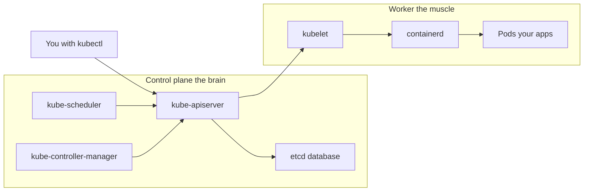

# Beginner's Guide: What the install script does, and why

This guide explains every component the installer touches, in plain language.
Each section follows the same shape:

> **What it is** -> **Why we install/configure it** -> **What the script does**

You don't need to read this end-to-end. Skip to whatever step you're curious
about.

---

## 1. The big picture: what is a Kubernetes cluster?

**What it is.** Think of Kubernetes as an "operating system for containers".
You hand it container images (your apps), and it decides which machine should
run them, restarts them when they crash, and gives them a way to talk to each
other over the network.

**Why a "single-node" cluster?** A real production cluster has many machines:
some run the *control plane* (the brain) and others run *workers* (the
muscle). On a single-node cluster, the same machine plays both roles. That's
perfect for learning, dev boxes, and small home-lab use.

**Why you'll see two kinds of components.**



On our single-node cluster, **everything in both boxes runs on the same
machine**.

---

## 2. The three Kubernetes command-line tools

- **`kubeadm`** - the *installer*. Run once to bootstrap the cluster.
- **`kubelet`** - a small agent that runs on every node, all the time. It's
  the thing that actually starts and stops containers when the control plane
  asks it to.
- **`kubectl`** - the tool *you* type into your terminal to talk to the
  cluster ("show me my pods", "deploy this app").

**What the script does.** Installs all three from the official Kubernetes apt
repo at `pkgs.k8s.io`, version `v1.32`, then `apt-mark hold`s them so they
won't accidentally get upgraded.

---

## 3. Container runtime: containerd

**What it is.** The program that actually pulls container images and runs
them on Linux. Kubernetes itself doesn't run containers; it tells containerd
to.

**Why containerd (and not Docker)?** Since Kubernetes 1.24, Docker is no
longer supported as a runtime directly. containerd is the lightweight,
standard runtime that Docker itself is built on top of.

**Why from Docker's apt repo?** Ubuntu's own `containerd` package is usually
older. Docker's repo ships current builds with the same `containerd.io`
package name everyone documents.

**What the script does.** Adds Docker's apt repo, installs `containerd.io`,
generates a default config at `/etc/containerd/config.toml`, then enables
the systemd cgroup driver (next section).

---

## 4. cgroup driver = systemd (the most common gotcha)

**What it is.** "cgroups" are a Linux kernel feature that limits how much CPU
and RAM a process can use. Both `kubelet` and `containerd` need to agree on
*who* is in charge of those limits.

**Why systemd.** Ubuntu 24.04 uses systemd to manage everything, so we tell
containerd "let systemd handle cgroups". If `kubelet` and `containerd`
disagree, `kubelet` will crash on startup with a confusing error message and
the cluster will never come up.

**What the script does.** Replaces `SystemdCgroup = false` with
`SystemdCgroup = true` in `/etc/containerd/config.toml` and restarts
containerd.

---

## 5. Why we disable swap

**What it is.** Swap is a chunk of disk Linux uses as "extra RAM" when real
RAM runs out.

**Why turn it off.** `kubelet` needs accurate memory accounting to schedule
pods. With swap on, a process might *seem* to use less memory than it
actually does, breaking the scheduler. `kubeadm` literally refuses to run if
swap is enabled.

**What the script does.** Runs `swapoff -a` (turns it off now), comments out
swap entries in `/etc/fstab` (so it stays off after reboot), and removes
`/swap.img` (the default swap file on Ubuntu 24.04 cloud images).

---

## 6. Kernel modules: `overlay` and `br_netfilter`

**What they are.** Two pieces of the Linux kernel that aren't always loaded
by default.

- `overlay` lets containerd build container filesystems by stacking image
  layers on top of each other. This is how containers start in milliseconds.
- `br_netfilter` lets the Linux firewall (`iptables`) see traffic that
  flows over Linux *bridges*. Pods talk to each other via a virtual bridge,
  so without this module, network rules and `kube-proxy` simply can't see
  pod traffic and routing breaks.

**What the script does.** Loads both modules now (`modprobe`) and writes
`/etc/modules-load.d/k8s.conf` so they load again on every boot.

---

## 7. sysctl settings

**What they are.** Tunable Linux kernel parameters.

- `net.ipv4.ip_forward = 1` - tells Linux it's allowed to forward packets
  between network interfaces. Pods sit "behind" the host, so the host has to
  act like a tiny router.
- `net.bridge.bridge-nf-call-iptables = 1` (and the `ip6` version) - the
  partner of `br_netfilter` from above. They make sure iptables rules
  actually apply to bridged pod traffic.

**What the script does.** Drops a config file at `/etc/sysctl.d/k8s.conf`
with these three lines and runs `sysctl --system` to apply them. They
persist across reboots automatically.

---

## 8. The Kubernetes apt repo (`pkgs.k8s.io`)

**What it is.** The official place to download `kubelet`, `kubeadm`, and
`kubectl` packages.

**Why this one.** The old `apt.kubernetes.io` repo was frozen in September
2023. The new repo is split per minor version (one repo for 1.32, another
for 1.33, etc.), which is why we explicitly pin to `v1.32`.

**Why `apt-mark hold`.** Without it, a stray `apt upgrade` could jump
`kubelet` from 1.32 to 1.33 in the middle of the night and break your
cluster. Holding the packages pins the version until you explicitly
unpin them.

**What the script does.** Adds the v1.32 channel, installs the three
packages, holds them, and enables the `kubelet` service.

---

## 9. `kubeadm init` - what actually happens

**What it does.** This single command does a lot:

1. Generates the cluster's TLS certificates.
2. Writes config files into `/etc/kubernetes/`.
3. Starts the four control-plane components as **static pods** on the
   local machine: `kube-apiserver`, `kube-scheduler`,
   `kube-controller-manager`, and `etcd` (the database).
4. Generates a join token in case you ever want to add worker nodes later.

**Why `--pod-network-cidr=10.244.0.0/16`.** This reserves an IP range that
pods will get their addresses from. Flannel expects this exact range as its
default, which is why we pick it. If you swap to Calico later you'd use
`192.168.0.0/16` instead.

**What the script does.** First runs `kubeadm config images pull` (just
pre-downloads images so the next step is faster), then runs `kubeadm init`
itself - but only if `/etc/kubernetes/admin.conf` doesn't already exist
(idempotency).

---

## 10. kubeconfig (`~/.kube/config`)

**What it is.** The "credentials + address book" that `kubectl` reads to
find your cluster and authenticate to it. Without it, `kubectl get nodes`
has no idea where to look.

**Why we copy it.** `kubeadm init` writes it to
`/etc/kubernetes/admin.conf`, which is owned by root. Copying it into your
home directory means you don't have to use `sudo` for every `kubectl`
command.

**What the script does.** Installs `/etc/kubernetes/admin.conf` to
`/root/.kube/config` and (if you ran the script with `sudo`) also to
`/home/<your-user>/.kube/config`, with correct ownership and `0600`
permissions.

---

## 11. CNI plugin: Flannel

**What CNI is.** "Container Network Interface" - the plugin standard that
gives every pod its own IP address and lets pods on different nodes talk to
each other. Without a CNI installed, your node stays in `NotReady` forever.

**Why Flannel.** It's the simplest option: one YAML file, low overhead, and
its default pod CIDR (`10.244.0.0/16`) matches the one we passed to
`kubeadm init`. It's a great choice for learning, dev, and most single-node
use cases. If you outgrow it, swap to Calico (network policies) or Cilium
(eBPF).

**What the script does.** Applies the latest official Flannel manifest with
`kubectl apply -f`. After ~30 seconds the node flips to `Ready`.

---

## 12. Removing the control-plane taint (single-node only)

**What a "taint" is.** A label on a node that says "don't schedule normal
pods here". Kubernetes puts one of these on every control-plane node by
default, so user apps don't compete for resources with the brain.

**Why we remove it.** On a single-node cluster the control plane *is* the
only node. If we leave the taint in place, `kubectl run nginx` will sit in
`Pending` forever because there's nowhere to schedule it.

**What the script does.** Runs:

```bash
kubectl taint nodes --all node-role.kubernetes.io/control-plane-
```

The trailing `-` means "remove this taint". Done.

---

## 13. Verifying the cluster works

```bash
kubectl get nodes
# NAME       STATUS   ROLES           AGE   VERSION
# my-host    Ready    control-plane   2m    v1.32.x

kubectl get pods -A
# Every pod in kube-system and kube-flannel should be Running.
```

A 10-second smoke test:

```bash
kubectl run hello --image=nginx --port=80
kubectl get pods            # Should reach Running
kubectl delete pod hello
```

---

## 14. What if I want to start over?

```bash
sudo kubeadm reset -f
sudo rm -rf /etc/cni/net.d ~/.kube /root/.kube
sudo systemctl restart containerd
```

Then re-run `sudo bash install-k8s.sh`. The script is idempotent, so this is
safe.

---

## 15. Mini-glossary

- **Pod** - the smallest unit Kubernetes runs; one or more containers that
  share a network/IP.
- **Node** - a machine (VM or physical) that's part of the cluster.
- **Container** - a running instance of an image.
- **Image** - a packaged app + its dependencies (e.g. `nginx:1.27`).
- **Namespace** - a folder-like grouping for cluster objects (e.g.
  `kube-system`).
- **Deployment** - a recipe that says "run N copies of this pod and keep
  them running".
- **Service** - a stable virtual IP / DNS name that load-balances to a set
  of pods.
- **CIDR** - an IP range like `10.244.0.0/16` (the `/16` defines the size).
- **CNI** - Container Network Interface; the plugin that gives pods their
  IPs.
- **Taint** - a "don't schedule here unless you tolerate me" mark on a node.
- **kubeconfig** - the file that tells `kubectl` how to reach and
  authenticate to a cluster.
- **Control plane** - the components that make decisions: api-server,
  scheduler, controller-manager, etcd.
- **cgroup** - the Linux kernel feature that enforces CPU/RAM limits on
  processes.
